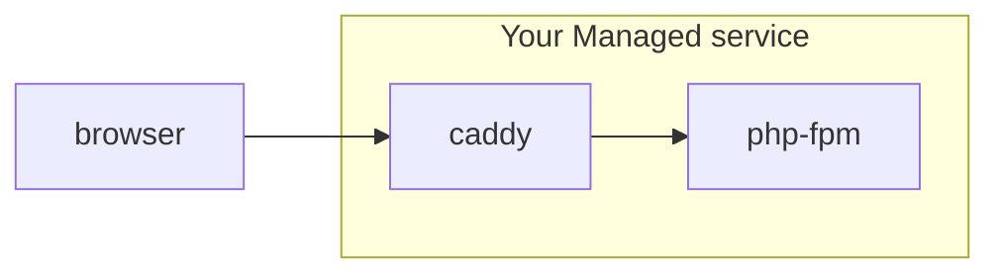

## Implementing a `CarbonTxt-Location` HTTP header with Caddy for carbon.txt

Consider the scenario where you are operate a managed WordPress service with a website at managed-service.com, but you serve your customer's websites at their own domain, like https://downstream-customer.com.


You use [Caddy](https://caddyserver.com/) as a reverse proxy server, which listens for inbound requests to https://downstream-customer.com, and either serves the static files itself, or forwards along the request to a PHP server like [PHP-FPM](https://php-fpm.org/)


### A very simplified diagram of this set up



For our purposes, let's assume you have followed the tutorial [here](https://caddy.community/t/setting-up-wordpress-with-caddy-on-ubuntu/18448) to set up Caddy to forward requests to PHP.

```
downstream-customer.com {
    # good practice to signal on behalf of who
    # are the certs getting issue
	tls your@email.com

    # logs are optional
	log {
		output file /var/log/caddy/your.domain
		format console
	}

	root * /srv/www/wordpress
	encode gzip
	file_server
	php_fastcgi unix//run/php/php-fpm.sock

	@disallowed {
		path /xmlrpc.php
		path *.sql
		path /wp-content/uploads/*.php
	}

	rewrite @disallowed '/index.php'
}
```

To add HTTP `CarbonTxt-Location` header, where you can point to a specific location for a carbon.txt file, you would add the following lines, using the caddy [header](https://caddyserver.com/docs/caddyfile/directives/header) directive.


```
    header CarbonTxt-Location "https://managed-service.com/carbon.txt"
```

```
downstream-customer.com {
    # good practice to signal on behalf of who
    # are the certs getting issue
	tls your@email.com

    # logs are optional
	log {
		output file /var/log/caddy/your.domain
		format console
	}

	root * /srv/www/wordpress
	encode gzip
	file_server
	php_fastcgi unix//run/php/php-fpm.sock

	@disallowed {
		path /xmlrpc.php
		path *.sql
		path /wp-content/uploads/*.php
	}

	rewrite @disallowed '/index.php'

    header CarbonTxt-Location "https://managed-service.com/carbon.txt"
}
```


## Further examples

This is an open source repository - if you're looking for specific example, or would like to contribute one, [please open an issue](https://github.com/thegreenwebfoundation/carbon.txt/issues).
