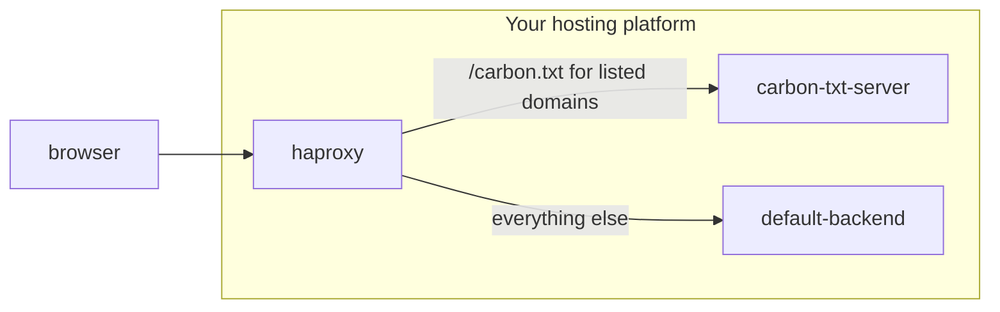

## Serving carbon.txt with HAProxy, with per-domain control

Consider the scenario where you run a shared or bulk hosting platform. You have many customer domains behind a single [HAProxy](https://www.haproxy.org/) reverse proxy, and you want to serve carbon.txt for *some* of those domains from a dedicated carbon.txt backend, while leaving the rest to be handled by their original backend.

This is common in shared hosting and bulk hosting, where you may run a dedicated service for serving carbon.txt files (for example, the [Cyberfusion carbon.txt server](https://github.com/CyberfusionIO/python3-cyberfusion-carbon-txt-server)), but you only want to route certain domains to it.

Unlike the other examples in this directory, this setup does *not* use the `CarbonTxt-Location` HTTP header. As [carbontxt.org/faq](https://carbontxt.org/faq) explains, `/carbon.txt` is the default location a lookup checks, so pointing a header elsewhere is unnecessary here — we serve the file at that default path and just control *which* backend answers.

### A very simplified diagram of this set up



### The most important pieces

In your `frontend`, you decide whether to send a request to the carbon.txt backend based on two conditions:

```haproxy
acl is-carbon-txt-acl path /carbon.txt
acl should-use-carbon-txt-policy hdr(host) -M -f /etc/haproxy/servecarbontxt.map

use_backend bk_carbon_txt if is-carbon-txt-acl should-use-carbon-txt-policy
```

Line by line, this means:

- `is-carbon-txt-acl` is true when the request path is exactly `/carbon.txt`.
- `should-use-carbon-txt-policy` is true when the request's `Host` header matches an entry in `/etc/haproxy/servecarbontxt.map`. This map file is a plain list of the domains you want to serve carbon.txt for, so you get granular, per-domain control over which sites HAProxy answers for and which are left to their original backend.
- `use_backend bk_carbon_txt if ...` sends the request to the dedicated carbon.txt backend only when *both* conditions are true.

### Full example

```haproxy
frontend ssl
  bind :::443 v4v6 ssl crt /etc/ssl/certs/example.pem

  mode http

  acl is-carbon-txt-acl path /carbon.txt
  acl should-use-carbon-txt-policy hdr(host) -M -f /etc/haproxy/servecarbontxt.map

  use_backend bk_carbon_txt if is-carbon-txt-acl should-use-carbon-txt-policy
  use_backend bk_default

backend bk_carbon_txt
  mode http
  server carbon-txt-server 2001:0db8:85a3::8a2e:0370:7334:8080 check

backend bk_default
  mode http
  server server 2001:0db8:85a3::9b5e:1196:7134:80 check
```

In plain words: if a request comes in for `/carbon.txt`, and the domain is listed in `/etc/haproxy/servecarbontxt.map`, HAProxy sends it to the `bk_carbon_txt` backend (your dedicated carbon.txt server). Every other request — including `/carbon.txt` for domains not in the map — goes to `bk_default`, the original backend.

To add a domain, add its hostname as a line in `/etc/haproxy/servecarbontxt.map`. To stop serving carbon.txt for a domain from HAProxy, remove its line.


## Further examples

This is an open source repository - if you're looking for specific example, or would like to contribute one, [please open an issue](https://github.com/thegreenwebfoundation/carbon.txt/issues).
