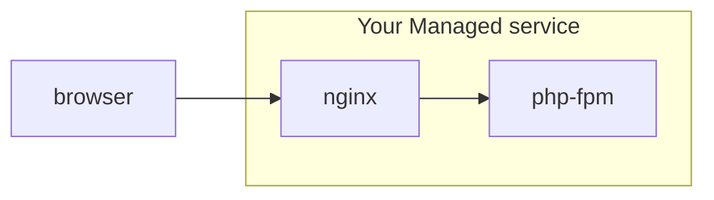

## Implementing a `via` HTTP header with Nginx for carbon.txt

Consider the scenario where you are operate a managed WordPress service with a website at managed-service.com, but you serve your customer's websites at their own domain, like https://downstream-customer.com.


You use [Nginx](https://nginx.org/en/) as a reverse proxy server, which listens for inbound requests to https://downstream-customer.com, and either serves the static files itself, or forwards along the request to a PHP server like [PHP-FPM](https://php-fpm.org/)


### A very simplified diagram of this set up



Nginx is a powerful tool, but for our purposes, let's assume you have defined a server accordingly, where most of the wordpress specific logic is in a separate file, as it outlined in the guidance on the [WordPress Devhub site](https://wordpress.org/documentation/article/nginx/), but you are serving a single site with a single nginx config file.

```nginx
 
server {
    server_name downstream-customer.com;
    root /var/www/downstream-customer.com;
 
    index index.php;

    include global/restrictions.conf;
 
    # Assume wordpress specific info goes here
    include global/wordpress.conf;

}
```

To add HTTP `Via` header, where you can point to a specific location for a carbon.txt file, you would add the following lines, using the [nginx add_header](https://www.keycdn.com/support/nginx-add_header) directive.


```nginx    
    location = /carbon.txt {
        add_header Via 1.1 https://managed-service.com/carbon.txt <long_generated_domain_hash>;
    }
```


```nginx
 
server {
    server_name downstream-customer.com;
    root /var/www/downstream-customer.com;
 
    index index.php;

    include global/restrictions.conf;
 
    # Assume wordpress specific info goes here
    include global/wordpress.conf;

    # extra header added here
    location = /carbon.txt {
        add_header Via 1.1 https://managed-service.com/carbon.txt <long_generated_domain_hash>;
    }

}
```

### Making the change further upstream at the server level, with a dynamic server

This isn't the only way to make this change. If you know what domain you are serving at the server level, 'behind' a reverse proxy like Nginx, you should also be able to serve the corresponding domain hash.

#### An example with WordPress:

In the scenario above, PHP-FPM is running Wordpress, 'behind' Nginx, and WordPress itself can add a `Via` HTTP Headers to HTTP responses too. 

Either via [one of the many HTTP Header plugins available](https://wordpress.org/plugins/), or by adding some custom code using WordPress's own [`send_headers()` hook](https://developer.wordpress.org/reference/hooks/send_headers/).

