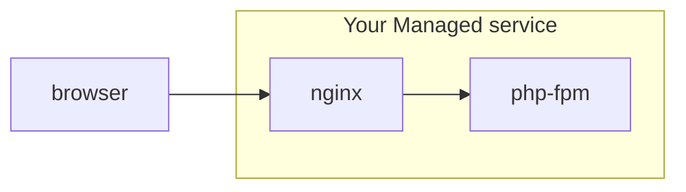

## Implementing a `CarbonTxt-Location` HTTP header with Nginx for carbon.txt

Consider the scenario where you are operate a managed WordPress service with a website at managed-service.com, but you serve your customer's websites at their own domain, like https://downstream-customer.com.


You use [Nginx](https://nginx.org/en/) as a reverse proxy server, which listens for inbound requests to https://downstream-customer.com, and either serves the static files itself, or forwards along the request to a PHP server like [PHP-FPM](https://php-fpm.org/)


### A very simplified diagram of this set up



Nginx is a powerful tool, but for our purposes, let's assume you have defined a server accordingly, where most of the wordpress specific logic is in a separate file, as it outlined in the guidance on the [WordPress Devhub site](https://wordpress.org/documentation/article/nginx/), but you are serving a single site with a single nginx config file.

```nginx

server {
    server_name downstream-customer.com;
    root /var/www/downstream-customer.com;

    index index.php;

    include global/restrictions.conf;

    # Assume wordpress specific info goes here
    include global/wordpress.conf;

}
```

To add HTTP `CarbonTxt-Location` header, where you can point to a specific location for a carbon.txt file, you would add the following lines, using the [nginx add_header](https://www.keycdn.com/support/nginx-add_header) directive.


```nginx
    add_header CarbonTxt-Location https://managed-service.com/carbon.txt;
```


```nginx

server {
    server_name downstream-customer.com;
    root /var/www/downstream-customer.com;

    index index.php;

    include global/restrictions.conf;

    # Assume wordpress specific info goes here
    include global/wordpress.conf;

    add_header CarbonTxt-Location https://managed-service.com/carbon.txt;

}
```


## Further examples

This is an open source repository - if you're looking for specific example, or would like to contribute one, [please open an issue](https://github.com/thegreenwebfoundation/carbon.txt/issues).
